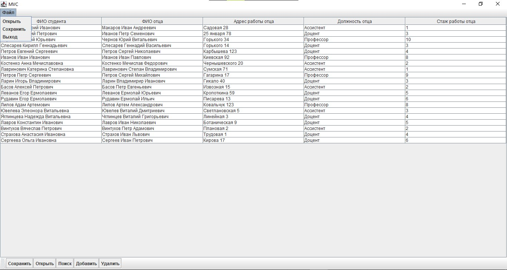
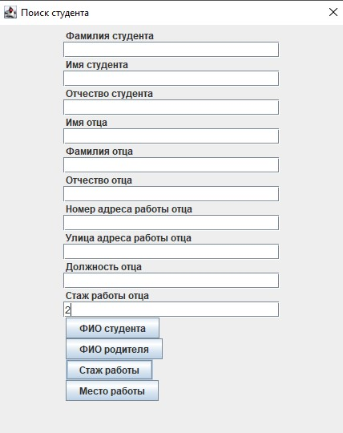
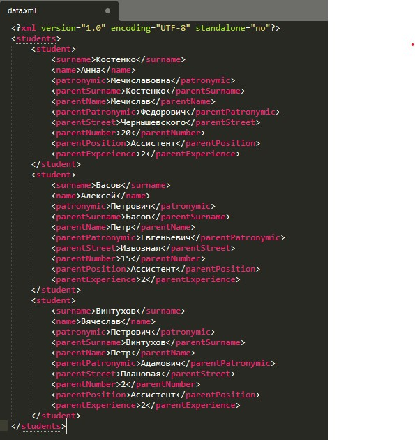

# Desktop GUI application with MVC pattern
The application uses the Swing library to display user data, performs various CRUD operations (without a database) using the MVC pattern.

Technology Stack:

    Swing toolkit

    Model-View-Controller pattern

Main window

Search menu

Xml file with data after search operation

